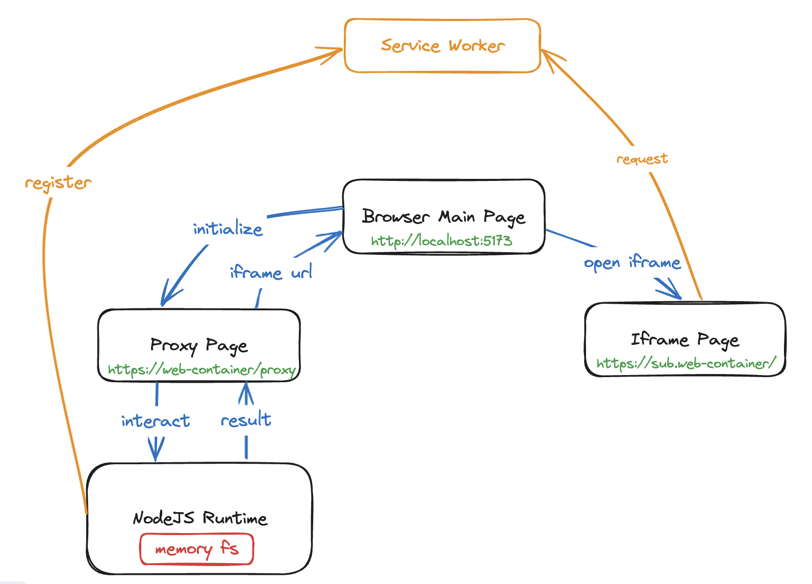

# JSDC Taiwan 2024 - Web Containers. Let's develop Web in Web

This is a Demo repository for JSDC Taiwan 2024 sharing about Web Containers.


## Install & Start
```bash
$ npm install
$ npm run dev
```


## Demo Pages
- [Demo1](http://localhost:5173/demo1)
- [Demo2](http://localhost:5173/demo2)
- [Demo3](http://localhost:5173/demo3)


## Api for Demo
- GET `http://localhost:8080/api/snapshot?folder=snapshots/vite-react`


## Folder Structure
```
└── 📁web-container-demo
    └── 📁snapshots
        └── 📁vite-react
            └── 📁src
                └── App.tsx
                └── main.tsx
            └── index.html
            └── package.json
            └── vite.config.js
    └── 📁src
        └── 📁lib
            └── webcontainer.js
        └── 📁pages
            └── demo1.jsx
            └── demo2.jsx
            └── demo3.jsx
            └── index.jsx
        └── 📁styles
            └── global.css
        └── App.jsx
        └── main.jsx
    └── .gitignore
    └── eslint.config.js
    └── index.html
    └── package.json
    └── postcss.config.js
    └── README.md
    └── tailwind.config.js
    └── vite.config.js
    └── server.js
```

## Web Container Flow
This is just a mock up flow for how web container works
